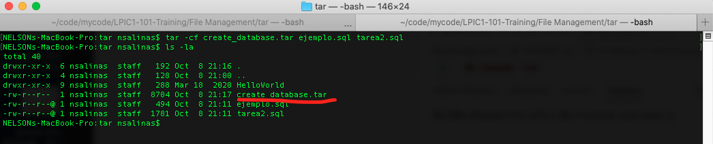
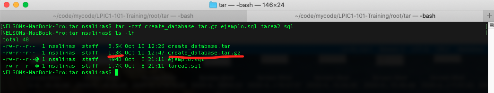
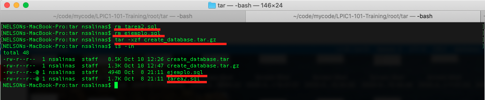
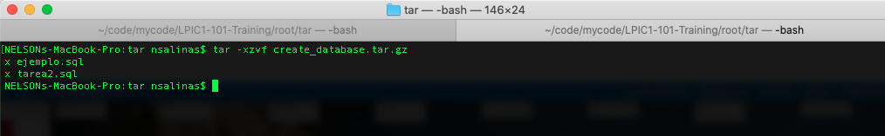
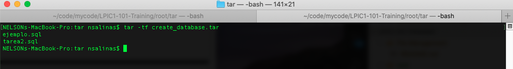
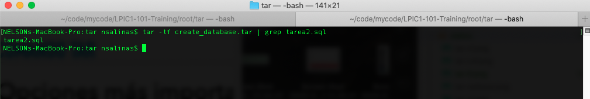
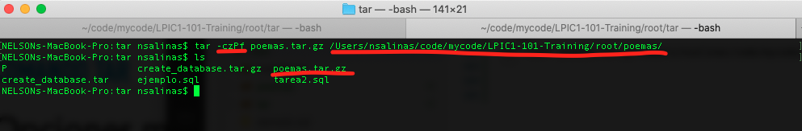
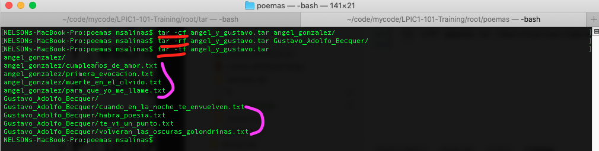

# LPIC1-101-Training
# Capitulo 1: Administración de Archivos

Bienvenido a esta sección de *Administración de archivos*.

El propósito de este repositorio, es conocer algunos comandos e ir practicando para el examen LPIC-1 101.

En este capítulo veremos el tratamiento de archivos como por ejemplo: copiar/pegar, crear archivos/directorios, comprimir/descomprimir, listar, usar comodines.

Con el fin de sentirnos cómodos con la consola, en este mismo directorio dejaré la carpeta con los archivos que iremos utilizando.


## Comando `tar`

Con este comando podemos manipular, compactar y comprimir archivos, también mediante opciones podemos escoger el método o algoritmo de compresión.

Sintaxis:
```sh
tar [opciones] [archivos | directorios]
```

En comparación con otros comandos, debemos tener cuidado con el orden en el cual colocamos las opciones

Compactar:
```sh
tar -cf create_database.tar ejemplo.sql tarea2.sql
```



Como podemos ver en la salida nos crea un archivo .tar y las opciones que usamos son:

- c : Crea un nuevo archivo (contenedor) de dos archivos sql
- f : Usa el archivo o contenedor para escribir.

Extraer:
```sh
tar -xf create_database.tar
```


En la salida podemos ver que nos deja los dos archivos que habiamos compactado.

- x : Extrae archivos a partir de un contenedor o archivo tar.
- f : Usa el archivo o contenedor para leer.

Comprimir:
```sh
tar -czf create_database.tar.gz ejemplo.sql tarea2.sql
```



Acá podemos ver claramente la diferencia de tamaños, en donde primero se comprimen los dos archivos y luego, listamos con el comando *ls -lh* (la opción -l es para listar y la opción -h le da formato al tamaño de los archivos ej: 1K, 234M 2G).

Es importante la diferencia que tenemos con el comando *tar -cf* ya que éste no comprime, sólo junta los archivos o directorios que nosotros le indicamos como origen.

Descomprimir un archivo tar.gz:
```sh
tar -xzf create_database.tar.gz
```



Primero eliminamos los archivos sql que teníamos, para finalmente ver el resultado del comando *tar -xzf* :

Las opciones son:

- -x: Extrae los archivos
- -z: Algortimo de descompresión gunzip
- -f: El fichero, que en nuestro caso es *create_database.tar.gz*

También podemos visualizar, que es lo que hace el comando con la opción -v

```sh
tar -xzvf create_database.tar.gz
```




Listar el contenido de un archivo tar:
```sh
tar -tf create_database.tar
```



Acá podemos ver los archivo que tiene ese contenedor. En el caso de que fuesen muchos archivos podríamos hacer uso del comando *less* y visualizar de una mejor manera.

A continuación dejo un ejemplo de cómo buscar dentro del archivo tar:

```sh
tar -tf create_database.tar | grep tarea2.sql
```



Comprimir archivos con rutas absolutas:
```sh
tar -czPf poemas.tar.gz /Users/nsalinas/code/mycode/LPIC1-101-Training/root/poemas/
```



A nuestro comando le agregamos la opción *P* la cual nos permite indicar una ruta absoluta, en nuestro caso le indicamos que queríamos comprimir la carpeta *poemas*, finalmente realizamos un *ls* para ver el archivo *.tar.gz*


Agregar archivos al contenedor:
```sh
tar -cf angel_y_gustavo.tar angel_gonzalez/
tar -rf angel_y_gustavo.tar Gustavo_Adolfo_Becquer/
tar -tf angel_y_gustavo.tar
```



El primer comando, ya lo hemos visto y es crear un archivo tar en donde el origen es la carpeta *angel_gonzalez/*, luego podemos ver que en vez de usar la opción *-c* usamos la *-r* en la cual indicamos que agregue la carpeta *Gustavo_Adolfo_Becquer/* a nuestro contenedor. Finalmente listamos el contenido de nuestro contenedor *-tf*.